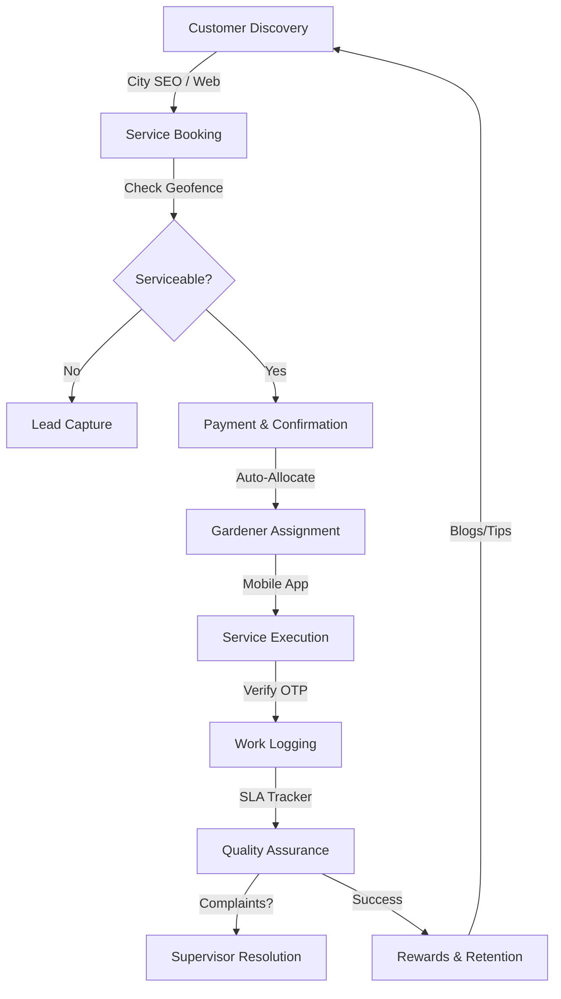

# Ghar Ka Mali — Project Workflow & Status

This document provides a comprehensive overview of the **Ghar Ka Mali Admin Dashboard**, detailing the current state of features, the system flow, and the ongoing development roadmap.

---

## 1. Features: What We Have Worked On (Stable)

These modules are fully implemented and integrated with the backend services.

*   **📊 Overview & Insights**
    *   **Dashboard**: Real-time stats for active bookings, total revenue, and system health.
    *   **Analytics**: Historical data visualization for growth and service trends.
*   **📅 Core Operations**
    *   **Bookings**: Management of On-Demand visits (Scheduling, Reassigning, Status tracking).
    *   **Subscriptions**: Lifecycle management (Active, Paused, Resumed, Cancelled states).
    *   **Management**: Automated assignment logic and manual overrides.
*   **👥 People Management**
    *   **Customers**: Deep-dive into customer history, addresses, and multi-asset management.
    *   **Gardeners**: Onboarding workflow, Approval/Rejection, and Performance auditing.
    *   **Supervisors**: Role-based access for field managers overseeing specific zones.
*   **🛠️ Catalog & Config**
    *   **Plans**: Dynamic subscription plans with configurable taglines, features, and themes.
    *   **Add-Ons**: Management of extra services (fertilizers, tools, specialized pruning).
    *   **Geofencing**: Definition of serviceable zones using polygon-based mapping.
*   **💰 Finance & Retention**
    *   **Rewards**: Point-based system for customer loyalty and gardener incentives.
    *   **Blogs**: CMS for publishing gardening tips and organic engagement content.

---

## 2. Features: What We Are Working On (Current Focus)

These features are being actively developed or refined for 100% backend parity.

*   **🔍 City SEO (Landing Pages)**: Advanced management of SEO meta-data and unique H1/About content for city-specific URLs (e.g., Noida, Delhi).
*   **🌿 Plant Identification Logs**: Tracking the history of plants identified at customer homes to provide personalized care recommendations.
*   **💸 Transaction Auditing**: Granular audit logs for all financial movements, wallet top-ups, and refunds.
*   **⏰ SLA Monitor**: Real-time tracking of Service Level Agreement breaches (e.g., late arrival, no-shows) with automated supervisor alerts.
*   **🎫 Complaints 2.0**: Enhanced ticket routing where specific complaints are auto-assigned to Supervisors for resolution.
*   **📈 Dynamic Pricing**: Support for weekend surge pricing and scheduled price hike logic.

---

## 3. System Flow: How it Works

The system operates as a closed-loop service delivery platform:

1.  **Entry**: Customer selects a service (Visit/Subscription) based on their zone.
2.  **Transaction**: Payment is processed, and a booking is generated in the system.
3.  **Scheduling**: The system matches the booking with the nearest available Gardener.
4.  **Field Work**: The Gardener completes the task, verified by an OTP from the customer.
5.  **Audit**: Admin/Supervisor monitors the session via the SLA Monitor and Complaints module.
6.  **Retention**: Post-service, rewards are issued, and SEO-driven blogs encourage re-engagement.

---

## 4. Technical Stack

*   **Frontend**: Next.js (App Router), TailwindCSS (Custom Design System).
*   **State Management**: Zustand (Admin Store) & React Query (Server State).
*   **Backend**: Node.js / MySQL (GKM Pro Core).
*   **Monitoring**: Integrated SLA Tracking & Audit Logs.

---
*Last Updated: March 30, 2026*
